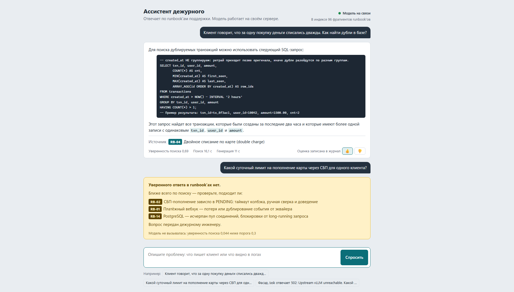
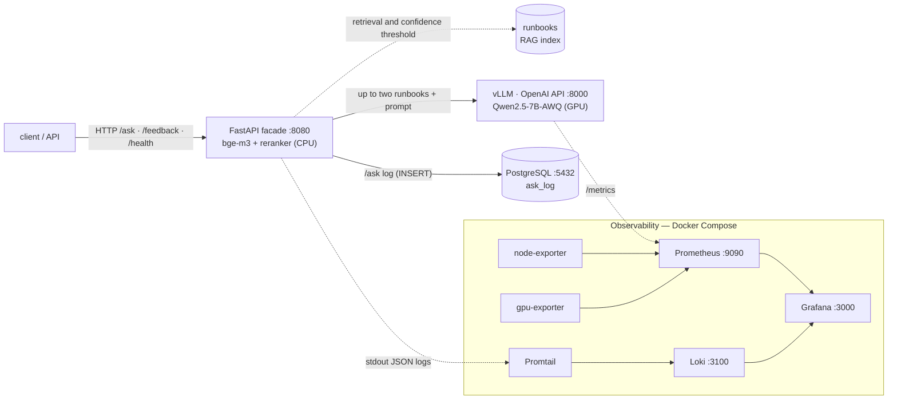
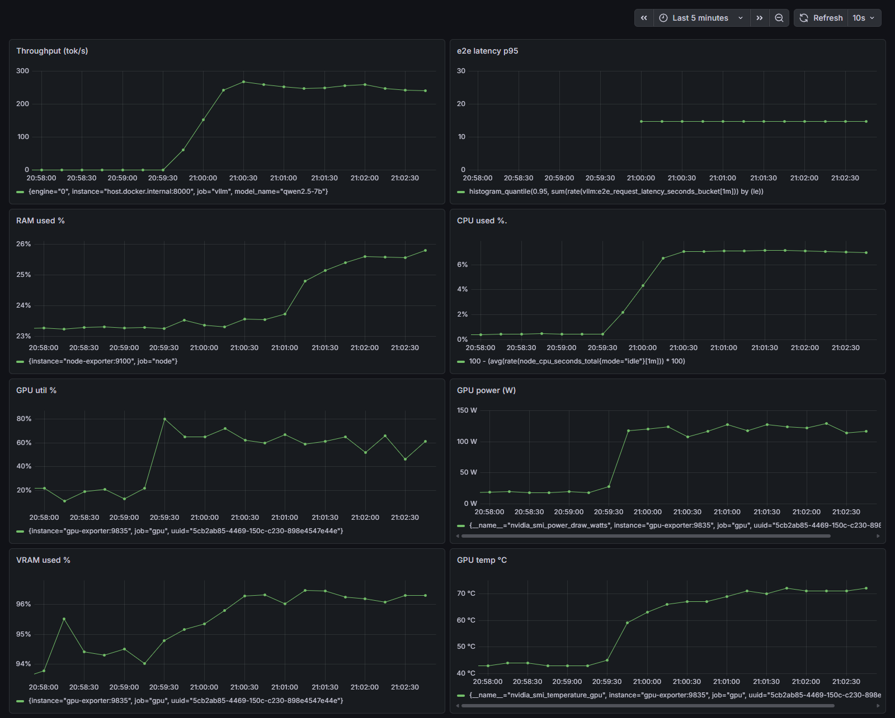

# On-premise AI assistant for company documents

[](https://github.com/jaganat666-a11y/onprem-rag-support-assistant/actions/workflows/ci.yml)

[Русский](README.md) · English

Answers employees' questions from internal documents and runs on the company's
own server: documents and questions never go to an external cloud service.
This matters when the documents contain customers' personal data (Russian
personal data law 152-FZ), trade secrets or infrastructure diagrams.

Every answer cites its source. If the documents don't contain the answer, the
assistant says so instead of making one up.

The example here is an IT support on-call team's runbooks — step-by-step
instructions for 16 fictional incidents at a fintech service; the repository
contains no real data. The same approach works for other documents: employee
policies, contracts and procurement documentation, equipment manuals, a
call-center knowledge base.



The running system; the interface and answers are in Russian. Top: an in-scope
question — steps and commands from the runbook, the source line is added by
code. Bottom: an out-of-scope question — the model is not called, and the
question goes to the on-call engineer with the closest runbooks suggested.

## What's built

- **One-command deployment**: the Qwen2.5-7B language model on an 8 GB GPU
  (vLLM server), retrieval, request log and monitoring — 9 Docker Compose
  services.
- **Measured quality**: 50 questions, two blind LLM judges and a script that
  checks commands — see below.
- **Measured throughput**: peak 962 tokens/s on a single GPU
  ([tuning.md](docs/tuning.en.md)). The peak was measured with speed-ups enabled
  (CUDA graphs, fp8 KV cache) under synthetic load; the deployed configuration
  runs without them, and all quality scores were measured on it.
- **Diagnostics with three tools**: metrics (Grafana), logs (Loki) and a
  per-request log in PostgreSQL with 👍/👎 ratings ([sql.md](docs/sql.en.md)).
  A database outage does not stop answers.

For the client — [pilot.md](docs/pilot.en.md): how employees work with the
assistant (using the on-call team example), pilot acceptance criteria, own
server vs cloud API — cost and payback, moving to other documents, and what is
needed before production.

## Answer quality

50 questions: 40 in scope and 10 out of scope, where the correct answer is an
honest refusal. Answers are graded blind by two judges — Claude Sonnet 5.5 and
the stricter Opus 5.5; a script, not a model, looks up command lines in the
runbook text.

| Qwen2.5-7B, 2026-10-01 | Result |
|---|---|
| Correct runbook ranked first | 40 of 40 |
| Correct answers, Sonnet / Opus judge | **32 / 26 of 40**, 1 incorrect |
| Command lines not from the runbooks | 5 in 5 answers, all flagged ⚠️ |
| Honest refusal out of scope | **10 of 10**, also 10 of 10 on the held-out set: below the retrieval confidence threshold the model is not called |
| Short chat-style questions (separate set, 10 in scope) | runbook ranked first in 9, but the threshold cuts off **8**: instead of an answer, the three closest runbooks, the right one among them in 8 of 8 |
| Response time, median / 95th percentile | 25 / 45 s |

The ⚠️ flags were added to the run's saved answers by the same guard code, and
the judges saw them; without the flags — 30 / 25 correct.

**Where the ceiling is.** Same retrieval, context and prompt, but a stronger
model writes the answer:

| Who writes the answer | Where it runs | Correct, Sonnet / Opus | Command lines not from the runbooks |
|---|---|---|---|
| Qwen2.5-7B-AWQ | own 8 GB GPU | 32 / 26 | 5 |
| GigaChat-2-Max | Sber cloud API | 36 / 34 | 10 |
| Claude Sonnet 5.5 | Anthropic cloud API | 40 / 39 | 0 |

The knowledge base is fictional, so no model knows the answers in advance, yet
a strong model with the same context almost never errs. Retrieval does its job;
the bottleneck is the model that fits in 8 GB. Cloud models are here for
comparison only: the assistant runs on the local one.

The numbers were reached step by step, measuring every change: code, not the
model, adds the source citation (extraneous runbook citations in 12 of 40
answers → 0), context is passed as whole runbooks, invented commands are
flagged by the guard. Methodology, measurement history and caveats (both
judges are Claude; Sonnet also graded its own answers) —
[eval.md](docs/eval.en.md).

## Architecture



- **Retrieval** on CPU: bge-m3 embeddings → reranking → up to two retrieved
  runbooks go into the context whole. Below the confidence threshold the model
  is not called.
- **Generation** on GPU: vLLM, Qwen2.5-7B-Instruct (AWQ). With vLLM on 8 GB, a
  7B model fits together with the context cache; 9B models did not fit.
- **Command guard**: code lines not found in the runbooks are flagged ⚠️ right
  in the answer. It catches added and altered lines; it does not catch skipped
  steps or warnings.
- **API**: `POST /ask`, `POST /feedback` (👍/👎), `GET /health`; `GET /` — demo
  chat.
- **Observability**: Prometheus + Grafana (9 panels), Loki, request log in
  PostgreSQL.

How each layer works — [operations.md](docs/operations.en.md).



Dashboard under load (6 concurrent requests): throughput at a plateau, GPU at
50–80%, the KV cache keeps VRAM near the 8 GB ceiling.

## Quick start

```bash
docker compose --profile gpu up -d   # full stack: vLLM on GPU, facade, request log, monitoring, logs
docker compose up -d                 # same without GPU services — for a machine without NVIDIA
```

The first run builds the facade image and downloads the models (Qwen ~5 GB,
bge-m3 and the reranker); vLLM is ready in 2–3 minutes, the facade at
`http://localhost:8080/`. Without vLLM the facade stays up: `/health` returns
503, `/ask` returns 502.

Facade tests run without a GPU or models (vLLM, the embedder and the database
are stubbed) and run in CI on every push:

```bash
pip install -r requirements-dev.txt && ruff check . && pytest
```

## Environment

RTX 3070 Ti Laptop 8 GB · Ryzen 7 6800H · 32 GB · Windows 11 + WSL2 (Ubuntu) ·
Docker 29.5 · vLLM 0.23. Developed with Claude Code.
