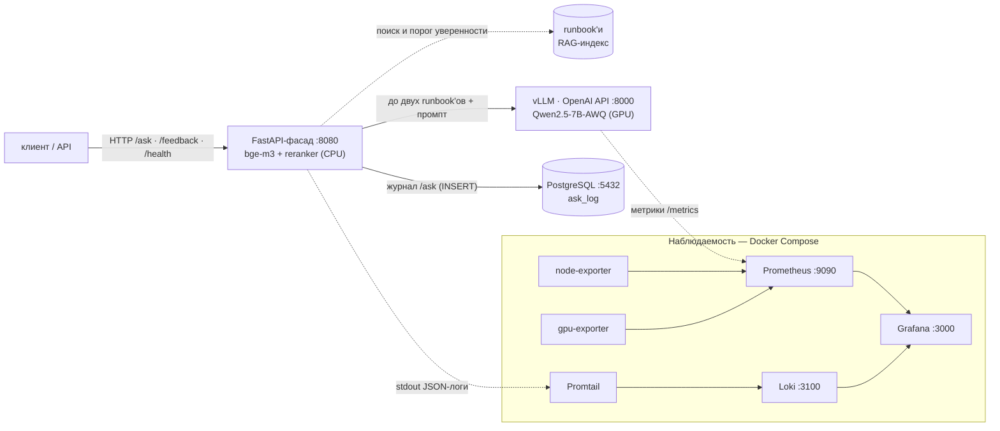

# Локальный ИИ-ассистент по документам компании

[](https://github.com/jaganat666-a11y/onprem-rag-support-assistant/actions/workflows/ci.yml)

Русский · [English](README.en.md)

Отвечает сотрудникам по внутренним документам и работает на сервере самой
компании: документы и вопросы не уходят во внешний облачный сервис. Это нужно,
когда в документах персональные данные клиентов (152-ФЗ), коммерческая тайна
или схемы инфраструктуры.

К каждому ответу — ссылка на источник. Если ответа в документах нет, ассистент
так и говорит, а не выдумывает.

Пример здесь — инструкции дежурной смены IT-поддержки (runbook'и) на 16
выдуманных инцидентов финтех-сервиса; реальных данных в репозитории нет. Та же
схема подходит для других документов: регламенты для сотрудников, договоры и
закупочная документация, техдокументация на оборудование, база знаний
колл-центра.


Снимок стенда. Сверху вопрос по базе: шаги и команды из runbook'а, источник
ставит код. Снизу вопрос вне базы: модель не вызывается, вопрос уходит
дежурному с подсказкой ближайших runbook'ов.

## Что сделано

- **Стенд поднимается одной командой**: языковая модель Qwen2.5-7B на
  видеокарте 8 ГБ (сервер vLLM), поиск, журнал запросов и мониторинг —
  9 сервисов Docker Compose.
- **Качество измерено**: 50 вопросов, два судьи-модели вслепую и проверка
  команд скриптом — ниже.
- **Скорость измерена**: пик 962 токена/с на одной видеокарте
  ([tuning.md](docs/tuning.md)). Пик снят в ускоренной настройке (CUDA-графы,
  fp8 KV-кеш) на синтетической нагрузке; стенд работает без них, и оценки
  качества сняты на нём.
- **Диагностика тремя инструментами**: метрики (Grafana), логи (Loki), журнал
  каждого запроса в PostgreSQL с оценками 👍/👎 ([sql.md](docs/sql.md)).
  Падение базы не останавливает ответы.

Для заказчика — [pilot.md](docs/pilot.md): как сотрудники работают с
ассистентом (на примере дежурной смены), критерии приёмки пилота, свой сервер
или облачный API — стоимость и окупаемость, перенос на другие документы и что
нужно до промышленной эксплуатации.

## Качество ответов

50 вопросов: 40 по базе и 10 вне её, где правильный ответ — честный отказ.
Ответы оценивают два судьи вслепую — Claude Sonnet 5.5 и более строгий
Opus 5.5; строки команд скрипт ищет в тексте runbook'ов, без модели.

| Qwen2.5-7B, 01.10.2026 | Результат |
|---|---|
| Нужный runbook найден первым | 40 из 40 |
| Верные ответы, судья Sonnet / Opus | **32 / 26 из 40**, неверный — 1 |
| Строки команд не из runbook'ов | 5 в 5 ответах, все помечены ⚠️ |
| Честный отказ вне базы | **10 из 10**, на отложенном наборе тоже 10 из 10: ниже порога уверенности поиска модель не вызывается |
| Короткие вопросы «как в чате» (отдельный набор, 10 по базе) | runbook первым в 9, но порог отсекает **8**: вместо ответа три ближайших runbook'а, нужный среди них — 8 из 8 |
| Время ответа, медиана / 95-й перцентиль | 25 / 45 с |

Пометки ⚠️ проставлены тем же кодом сторожа на сохранённых ответах прогона, и
судьи их видели; без пометок — 30 / 25 верных.

**Где предел.** Тот же поиск, контекст и промпт, а ответ пишет модель сильнее:

| Кто пишет ответ | Где работает | Верные, Sonnet / Opus | Строки команд не из runbook'ов |
|---|---|---|---|
| Qwen2.5-7B-AWQ | своя видеокарта 8 ГБ | 32 / 26 | 5 |
| GigaChat-2-Max | облачный API Сбера | 36 / 34 | 10 |
| Claude Sonnet 5.5 | облачный API Anthropic | 40 / 39 | 0 |

База выдуманная, ответов заранее не знает ни одна модель, а сильная на том же
контексте почти не ошибается. Значит, поиск справляется, а узкое место —
модель, которая помещается в 8 ГБ. Облачные модели здесь только для сравнения:
ассистент работает с локальной.

Цифры получены по шагам, с замером на каждую правку: ссылку на источник ставит
код, а не модель (лишние ссылки на runbook'и в 12 ответах из 40 → 0), контекст — целыми runbook'ами, выдуманные команды
помечает сторож. Методика, история замеров и оговорки (оба судьи — Claude,
Sonnet оценивал и свои ответы) — [eval.md](docs/eval.md).

## Архитектура



- **Поиск** на CPU: эмбеддинг bge-m3 → реранк → до двух найденных runbook'ов
  целиком в контекст. Ниже порога уверенности модель не вызывается.
- **Генерация** на GPU: vLLM, Qwen2.5-7B-Instruct (AWQ). На vLLM в 8 ГБ вместе с
  кешем контекста помещается 7B; модели 9B уже не влезли.
- **Сторож команд**: строки кода, которых нет в runbook'ах, помечаются ⚠️ прямо
  в ответе. Ловит добавленные и изменённые строки; пропуски шагов и
  предупреждений не ловит.
- **API**: `POST /ask`, `POST /feedback` (👍/👎), `GET /health`; `GET /` — демо-чат.
- **Наблюдаемость**: Prometheus + Grafana (9 панелей), Loki, журнал в PostgreSQL.

Устройство слоёв — [operations.md](docs/operations.md).


Дашборд под нагрузкой (6 параллельных запросов): пропускная способность на
плато, GPU загружен на 50–80%, KV-кеш держит видеопамять у потолка 8 ГБ.

## Запуск

```bash
docker compose --profile gpu up -d   # весь стенд: vLLM на GPU, фасад, журнал, мониторинг, логи
docker compose up -d                 # то же без GPU-сервисов — для машины без NVIDIA
```

Первый запуск собирает образ фасада и скачивает модели (Qwen ~5 ГБ, bge-m3 и
реранкер); vLLM готов через 2–3 минуты, фасад — `http://localhost:8080/`.
Без vLLM фасад не падает: `/health` отвечает 503, `/ask` — 502.

Тесты фасада идут без GPU и моделей (vLLM, эмбеддер и БД — заглушки) и
запускаются в CI на каждый push:

```bash
pip install -r requirements-dev.txt && ruff check . && pytest
```

## Окружение

RTX 3070 Ti Laptop 8 ГБ · Ryzen 7 6800H · 32 ГБ · Windows 11 + WSL2 (Ubuntu) ·
Docker 29.5 · vLLM 0.23. Разработка — в Claude Code.
