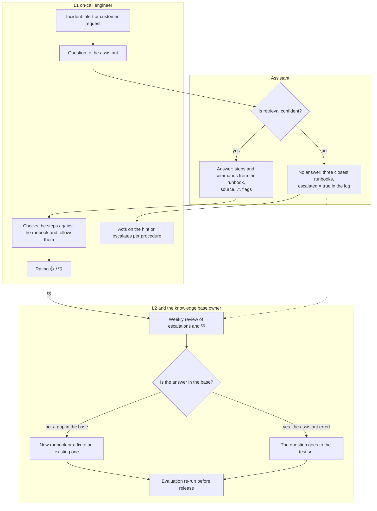

# Pilot: process, acceptance, cost

[Русский](pilot.md) · English

How the assistant fits into a company's work, what criteria to accept the pilot
by, and what an answer costs. The process and criteria are shown on the example
of a support on-call team — the setup is built on it; what changes for other
documents is in [Moving to other documents](#moving-to-other-documents).
Figures for the setup come from the [quality evaluation](eval.en.md);
thresholds and timelines are a proposal for discussion with the client.

## The task

A company has a base of internal documents, and employees search it for answers
by hand. The assistant answers from this base with a source citation, and if
the base has no answer, it says so. It makes no decisions and takes no actions.

Example: a support on-call team. A first-line (L1) on-call engineer gets an
alert or a customer request, looks for the right runbook — a step-by-step
instruction for a typical incident — and follows the steps. In payment
incidents a mistake costs money: a double credit, or a refund where the runbook
forbids one. That is why here the assistant also flags commands that are not in
the base.

| Who | What they get |
|---|---|
| L1 on-call engineer | steps and commands from the runbook with a citation; if there is no answer, the three closest runbooks |
| L2 (second line) and the knowledge base owner | unanswered questions and 👎 answers — in one SQL query |
| Shift lead | share of 👎, share of escalations, response time |
| Information security | data stays inside the perimeter, every question is logged |

## Process

Every escalation and every 👎 either closes a gap in the base or becomes a test.
Queries for the review are in [sql.en.md](sql.en.md), sections 8–9.

## Acceptance criteria

| Criterion | Setup now (Qwen2.5-7B) | Threshold | |
|---|---|---|---|
| Advice that contradicts the runbook in money operations | 1 of 40: a refund that RB-02 forbids | 0 | ✗ |
| Correct answers, strict judge (Opus 5.5) | 26 of 40 (65%) | ≥ 90% plus manual review of a sample | ✗ |
| Invented commands without a ⚠️ flag | 0: all 5 flagged | 0 | ✓ |
| Honest refusal on out-of-scope questions | 10 of 10 | ≥ 95% | ✓ |
| In-scope questions left unanswered | 0 of 40 detailed; 8 of 10 short chat-style | ≤ 10% | ✗ |
| Response time, 95th percentile | 45 s (median 25 s, of which 16 s is CPU retrieval) | ≤ 30 s | ✗ |

The setup passes two criteria of six. Accuracy and the dangerous advice are
limited by the model: with the same context, the strict judge accepted 34 of 40
answers from GigaChat-2-Max and 39 from Claude Sonnet. Short questions are
limited by the retrieval confidence threshold, response time by the reranker on
CPU. That is why the pilot starts with choosing the model, not with buying
hardware. On 40 questions the 65% accuracy is known within ±15 pp; for
acceptance the set is expanded to 200+ anonymized questions from the team's
work chat.

## Pilot stages

1. **Model selection, 2–3 weeks.** The expanded set is run on local models
   larger than 7B and on a cloud API for comparison. The chosen model defines
   the server configuration.
2. **Shadow mode, 2–4 weeks.** The assistant answers; on-call engineers work as
   before and rate the answers.
3. **Live mode on one shift.** Time from incident opening to first action is
   compared with the other shifts using the ticketing system.
4. **Scale-up decision** — based on the acceptance thresholds and the log
   metrics: share of 👎, share of escalations, response time.

## Own server or cloud API

The cloud option is shown on the example of GigaChat-2-Max, Sber's Russian
cloud API: its answers were graded on the same set. An average answer is 2.1k
tokens: 1.8k in (question and runbooks) and 0.27k out.

| | Own server | GigaChat-2-Max API |
|---|---|---|
| Correct answers, strict judge | 26 of 40 (setup, 7B) | 34 of 40 |
| Cost of an answer | no per-token charge — you pay for owning the server: purchase or rent, power and engineer hours | ~₽1.4 (₽0.65 per 1,000 tokens incl. VAT); 10,000 questions a month — ~₽14k |
| Data | stays inside the perimeter | the question and runbooks go to Sber's cloud |
| Model version | pinned | changed by the provider; the evaluation is re-run |

In money terms the cloud wins: at 10,000 questions a month an own server pays
off only if owning it for three years costs less than ₽0.5M. The server price
will be set by the model choice at the first stage. But data requirements
decide, not price. Under the Russian personal data law (152-FZ), customers'
personal data may be passed to an external service only on a lawful basis and
under a contract with it; on top of that come trade secrets and industry
regulators' requirements. In the example, on-call questions may contain
transaction numbers and customer data, and runbooks contain addresses and
infrastructure diagrams. If such data may go to a provider, the cloud is
cheaper and more accurate; if not, you need your own server.

GigaChat pricing follows the [business tariff](https://developers.sber.ru/docs/ru/gigachat/tariffs/legal-tariffs)
as of 2026-09-29; tokens were counted with the Qwen tokenizer, so the estimate
is approximate. Quality was compared under unequal conditions: temperature 0
for the 7B, default API settings for GigaChat, one run each
([eval.en.md](eval.en.md)).

## Moving to other documents

The assistant's design does not depend on what the documents are about. For
policies, contracts or technical documentation, what changes is the
configuration for the documents and the client's process.

**Changes:** the document base and how it is split — now these are markdown
files split into sections by headings, and PDF or Word files are converted to
text first; the model prompt, written for on-call instructions; the evaluation
question set — taken from employees' real questions; the confidence threshold —
re-tuned on the new documents; roles and acceptance criteria — to match the
client's process.

**Stays:** retrieval with a confidence threshold, answers with a source
citation and refusal outside the base; the evaluation methodology (on real
documents the judge must be local too); the request log with a review of
escalations and 👎; monitoring.

The guard checks only commands: it looks up every code line of the answer in
the instruction text. In contracts and policies the dangerous error is
different — a wrong amount, deadline or clause number — and a guard for that
(checking figures and deadlines in the answer against the source) has to be
built separately.

## What is needed before production

| Area | On the setup now | What to do |
|---|---|---|
| Access | `/ask` without authentication, default passwords | corporate SSO login, roles to match the client's process (in the example L1 / L2 / base owner), secrets from a vault |
| Network | 8 ports open on all interfaces | only the facade exposed, behind TLS |
| Log | the question is stored as is, author unknown | masking of personal data (transaction numbers, phone numbers), question author, retention period |
| Critical steps | the model advised a refund against the runbook | money steps and irreversible actions — always flagged "L2 only" |
| Base updates | runbooks are baked into the image | base from the documentation repository, zero-downtime reindexing, evaluation re-run |
| Monitoring | metrics only from the model server, no alerts | facade metrics, alerts linking to the runbook, log backup |
