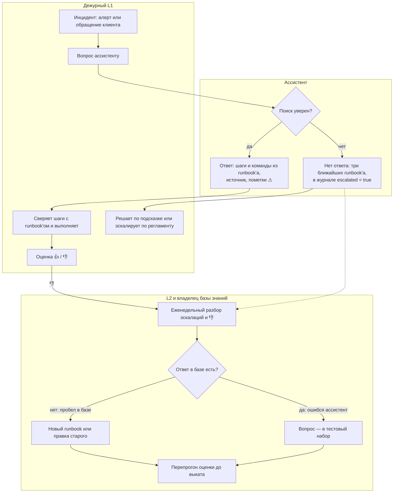

# Пилот: процесс, приёмка, стоимость

Как ассистент встраивается в работу дежурной смены, по каким критериям
принимать пилот и сколько стоит ответ. Цифры стенда — из [оценки качества](eval.md);
пороги и сроки — предложение для обсуждения с заказчиком.

## Задача

Дежурный L1 получает алерт или обращение клиента, ищет нужный runbook и
выполняет шаги. В платёжных инцидентах ошибка стоит денег: двойное зачисление,
возврат там, где runbook его запрещает. Ассистент отвечает по базе runbook'ов,
ставит ссылку на источник и помечает команды, которых в базе нет. Решений он не
принимает и команд не выполняет.

| Кто | Что получает |
|---|---|
| Дежурный L1 | шаги и команды из runbook'а со ссылкой; если ответа нет — три ближайших runbook'а |
| L2 и владелец базы знаний | вопросы без ответа и ответы с 👎 — одним SQL-запросом |
| Руководитель смены | долю 👎, долю эскалаций, время ответа |
| ИБ | данные не выходят за контур, все вопросы в журнале |

## Процесс

Каждая эскалация и каждый 👎 либо закрывают пробел в базе, либо становятся
тестом. Запросы для разбора — в [sql.md](sql.md), разделы 8–9.

## Критерии приёмки

| Критерий | Стенд сейчас (Qwen2.5-7B) | Порог | |
|---|---|---|---|
| Советы против runbook'а в действиях с деньгами | 1 из 40: возврат, который RB-02 запрещает | 0 | ✗ |
| Верные ответы, строгий судья (Opus 5.5) | 26 из 40 (65%) | ≥ 90% и ручная проверка выборки | ✗ |
| Выдуманные команды без пометки ⚠️ | 0: все 5 помечены | 0 | ✓ |
| Честный отказ на вопросы вне базы | 10 из 10 | ≥ 95% | ✓ |
| Вопросы по базе без ответа | 0 из 40 подробных; 8 из 10 коротких «как в чате» | ≤ 10% | ✗ |
| Время ответа, 95-й перцентиль | 45 с (медиана 25 с, из них 16 с — поиск на CPU) | ≤ 30 с | ✗ |

Стенд проходит два критерия из шести. Точность и опасный совет упираются в
модель: на том же контексте строгий судья засчитал GigaChat-2-Max 34 ответа из
40, Claude Sonnet — 39. Короткие вопросы упираются в порог уверенности поиска,
время — в реранкер на CPU. Поэтому пилот начинается с выбора модели, а не с
закупки железа. На 40 вопросах точность 65% известна в пределах ±15 п.п., для
приёмки набор расширяют до 200+ обезличенных вопросов из рабочего чата.

## Этапы пилота

1. **Выбор модели, 2–3 недели.** Расширенный набор — на локальных моделях
   крупнее 7B и на GigaChat API. Выбранная модель задаёт конфигурацию сервера.
2. **Теневой режим, 2–4 недели.** Ассистент отвечает, дежурные работают как
   раньше и оценивают ответы.
3. **Рабочий режим на одной смене.** Время от открытия инцидента до первого
   действия сравнивается с остальными сменами по тикет-системе.
4. **Решение о масштабировании** — по порогам приёмки и метрикам из журнала:
   доля 👎, доля эскалаций, время ответа.

## Свой сервер или GigaChat API

Средний ответ — 2,1 тыс. токенов: 1,8 тыс. на входе (вопрос и runbook'и) и
0,27 тыс. на выходе.

| | Свой сервер | GigaChat-2-Max API |
|---|---|---|
| Верные ответы, строгий судья | 26 из 40 (стенд, 7B) | 34 из 40 |
| Цена ответа | токены почти бесплатны ([0,44 ₽ за 1 млн](tuning.md) — электричество под нагрузкой); платят за сервер, круглосуточное питание (~1,6 тыс. ₽ в месяц при 0,3 кВт) и часы инженера | ~1,4 ₽ (0,65 ₽ за 1 000 токенов с НДС); 10 000 вопросов в месяц — ~14 тыс. ₽ |
| Данные | не покидают контур | вопрос и runbook'и уходят в облако Сбера |
| Версия модели | закреплена | меняет провайдер, оценку перепрогоняют |

По деньгам облако выгоднее: при 10 000 вопросах в месяц свой сервер окупается,
только если владение им за три года дешевле 0,5 млн ₽. Цену сервера определит
выбор модели на первом этапе. Но решают требования ИБ, а не цена: в вопросах
дежурных бывают номера транзакций и данные клиентов, в runbook'ах — адреса и
схемы инфраструктуры. Можно передавать их провайдеру — облако дешевле и
точнее; нельзя — нужен свой сервер.

Цена GigaChat — по [тарифу для юрлиц](https://developers.sber.ru/docs/ru/gigachat/tariffs/legal-tariffs)
на 29.09.2026, токены посчитаны токенизатором Qwen — оценка ориентировочная.
Качество сравнивалось в неравных условиях: у 7B температура 0, у GigaChat —
настройка API по умолчанию, по одному прогону ([eval.md](eval.md)).

## Что нужно до промышленной эксплуатации

| Область | Сейчас на стенде | Что сделать |
|---|---|---|
| Доступ | `/ask` без аутентификации, пароли по умолчанию | вход через корпоративный SSO, роли L1 / L2 / владелец базы, секреты из хранилища |
| Сеть | 8 портов открыты на всех интерфейсах | наружу — только фасад за TLS |
| Журнал | вопрос пишется как есть, автор неизвестен | маскирование номеров транзакций и телефонов, автор вопроса, срок хранения |
| Деньги | модель посоветовала возврат вопреки runbook'у | шаги с деньгами — всегда с пометкой «только L2» |
| Обновление базы | runbook'и встроены в образ | база из репозитория документации, переиндексация без простоя, перепрогон оценки |
| Мониторинг | метрики только у сервера модели, алертов нет | метрики фасада, алерты со ссылкой на runbook, резервная копия журнала |
